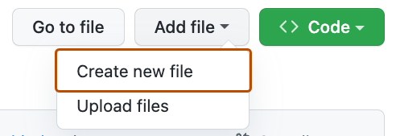
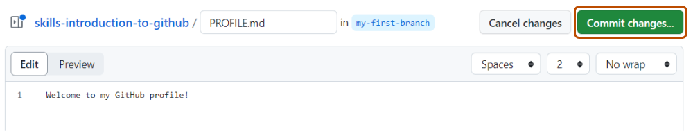
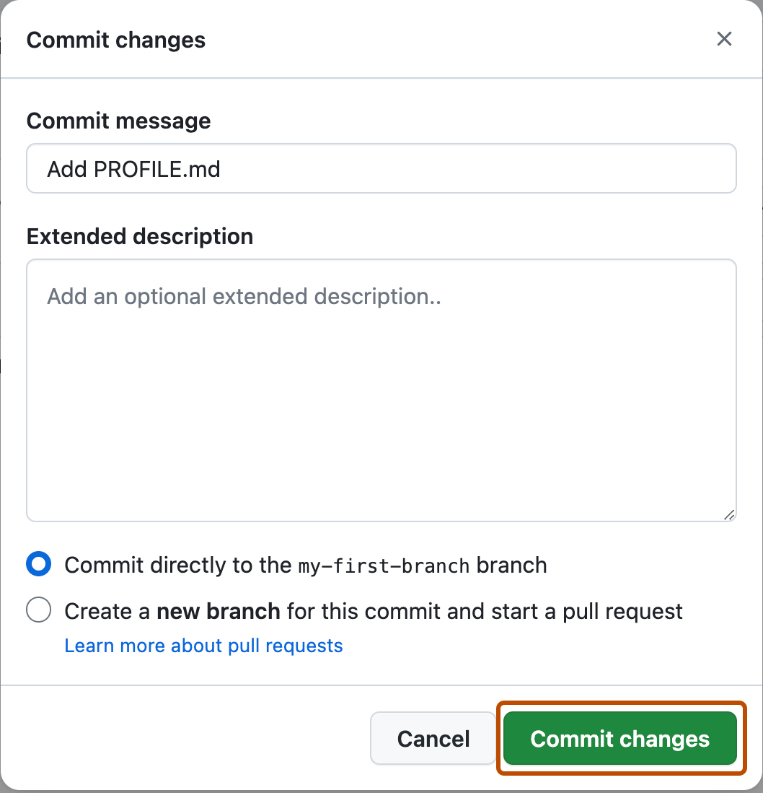

## ステップ 2: ファイルをコミットする

_ブランチを作成できました！ :tada:_

ブランチを作成すると、`main` ブランチを変更せずにプロジェクトを編集できます。ブランチを作成したので、次はファイルを作成して最初のコミットを行いましょう！

**コミットとは？**: _[コミット](https://docs.github.com/ja/pull-requests/committing-changes-to-your-project/creating-and-editing-commits/about-commits)_ とは、ファイルやフォルダーに対する変更のまとまりです。コミットはプロジェクトの履歴に変更を記録し、何を変更したのかを後から確認できるようにします。

### :keyboard: アクティビティ: 最初のコミット

次の手順では、GitHub 上で変更をコミットする流れを案内します。コミットには、ファイルの追加・削除・名前変更や、ファイル内容の変更など、プロジェクトへの変更が記録されます。

> [!NOTE]
> `.md` は Markdown ファイルを作成するための拡張子です。Markdown について詳しくは、「[基本的な書き方と書式設定の構文](https://docs.github.com/ja/get-started/writing-on-github/getting-started-with-writing-and-formatting-on-github/basic-writing-and-formatting-syntax)」を参照してください。

1. リポジトリのヘッダーメニューにある **< > Code** タブで、新しいブランチ `my-first-branch` が選択されていることを確認します。

2. **Add file** ドロップダウンを選択し、**Create new file** をクリックします。

   

3. **Name your file...** フィールドに `PROFILE.md` と入力します。

4. **Enter file contents here** のエリアに、次の内容をコピーしてファイルに貼り付けます。

   ```
   Welcome to my GitHub profile!
   ```

   

5. 内容ボックスの右上にある **Commit changes...** をクリックします。ダイアログが表示されます。

6. GitHub は簡単なデフォルトメッセージを提案してくれますが、練習のため少し変更してみましょう。**Commit message** フィールドに `Add PROFILE.md` と入力します。
   
   - **コミットメッセージ** と、任意の **詳細な説明** を書くことで、変更内容がわかりやすくなります。特に、複数のファイルにまたがる変更では役立ちます。

   

6. このレッスンでは、今は他のフィールドは無視して **Commit changes** をクリックします。

7. ファイルを変更したので、Mona はすでにあなたの作業を確認しているはずです。少し待って、コメントを確認してみましょう。進捗情報と次のレッスンが表示されます。


<details>
<summary>困っていますか？ 🤷</summary><br/>

フィードバックが表示されない場合は、次の点を確認してください。
- `my-first-branch` ブランチにいることを確認してください。
- `PROFILE.md` ファイルが作成され、ルートフォルダーにあることを確認してください。

</details>
